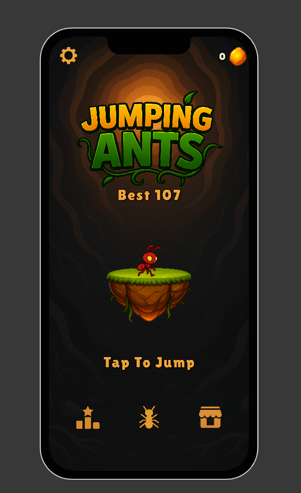
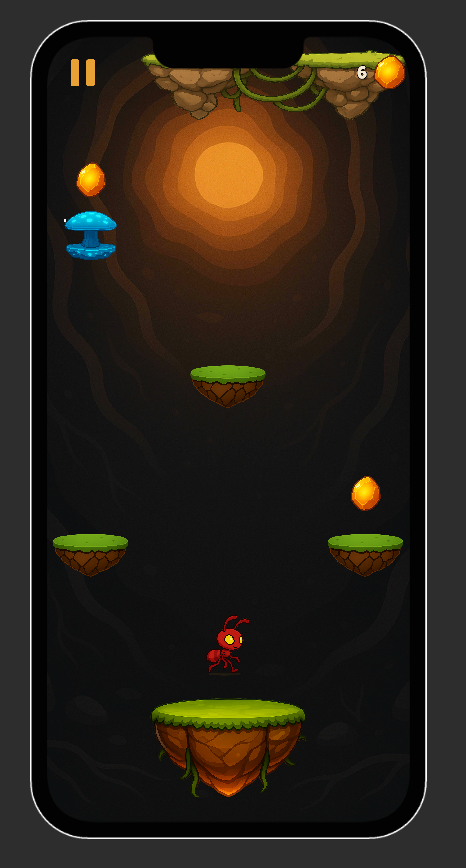
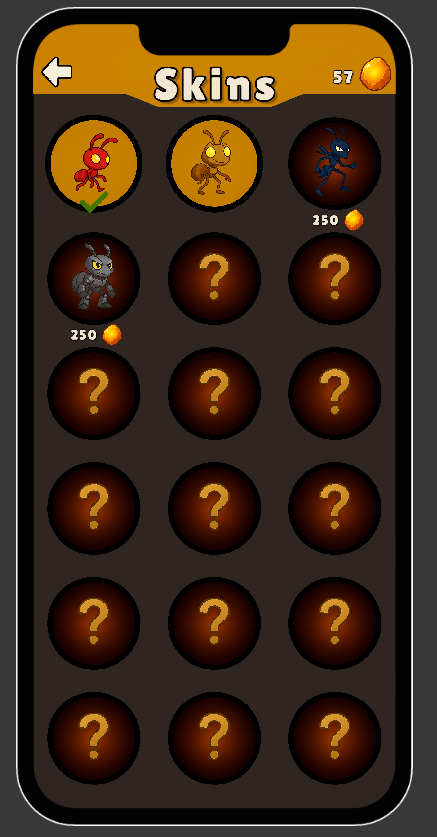
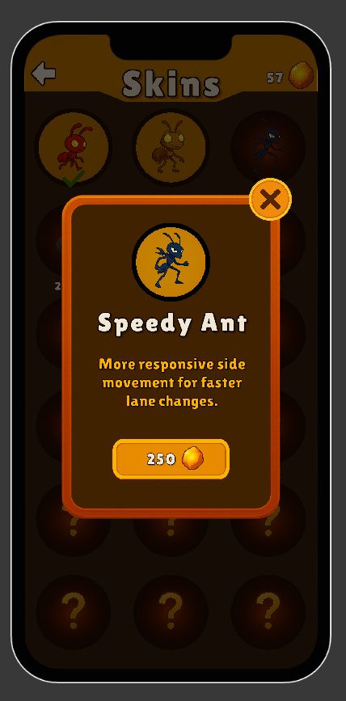
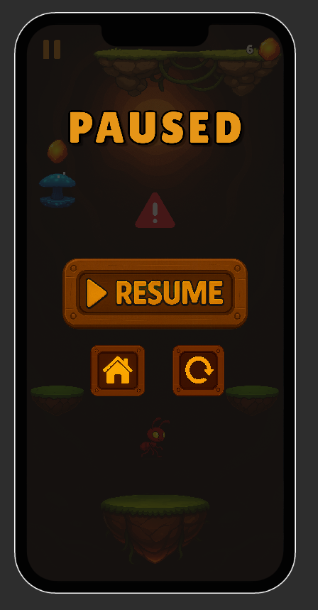
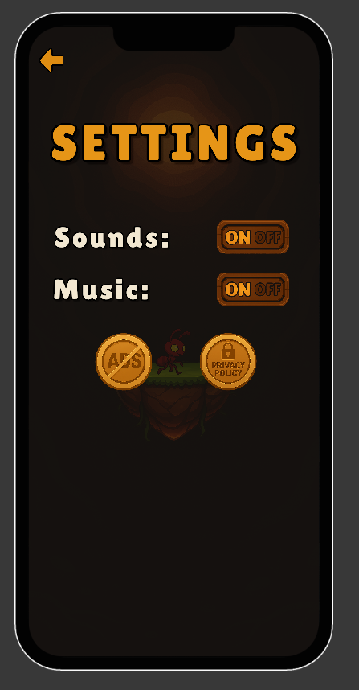
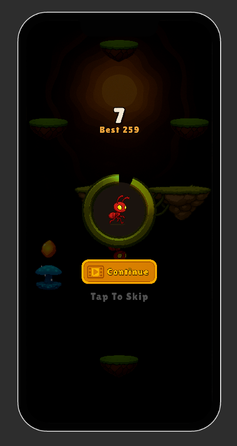

# 🐜 Jumping Ants

**Vertical Infinite Jumper | Mobile Game (Work in Progress)    
[[Sort GamePlay Vİdeo](https://youtube.com/shorts/2xqJz6CFSDI?feature=share)]**

---

## 🎮 Overview

Hi! I'm Arif, a second-year Software Engineering student, and this is my first self-made mobile game. It’s the result of around five months of learning Unity, experimenting, and building with passion and it’s still evolving.

## 📸 Screenshots

  
  
  
  
  
  
  

---

## ⚙️ Technical Highlights

This project was developed with a strong focus on **how the system works internally**, not just the final gameplay output.

### 🚀 Performance & Memory Management

**Generic Object Pooling System**

To avoid runtime allocations and GC spikes caused by frequent `Instantiate` / `Destroy` calls on mobile devices, I implemented a reusable and generic **Object Pooling** system.

Used for:

* Platforms
* Obstacles (e.g., meteors)

This ensures stable performance and smooth gameplay.

> Reference: `ObjectPool.cs`

---

### 🏗️ Clean Architecture & Decoupling

**Observer Pattern & Controlled Singleton Usage**

To prevent tight coupling and "spaghetti code", the project follows an **event-driven architecture** using the Observer pattern.

Examples:

* When the player dies, UI, audio, and game state systems react independently
* Score updates are broadcast without direct references

This approach keeps systems modular, testable, and easy to extend.

> Reference: `GameManager.cs`, `PlatformSpawner.cs`

---

### 🎨 Procedural Platform Level Design

**ScriptableObject-Based Pattern System**

The infinite level structure is driven by **ScriptableObjects** (`PatternData`). Platform patterns and difficulty parameters can be tweaked directly from the Unity Editor without modifying code.

Benefits:

* Designer-friendly workflow
* Easy difficulty curve balancing
* Scalable content system for future updates

---

## 📬 Contact

This project is an important milestone in my game development journey. Thank you for taking the time to explore it.

* **LinkedIn:** [[/linkedin/arifakgul](https://www.linkedin.com/in/arifakgul/)]
* **Email:** [arifakgl34@gmail.com]

---

Developed with  by **Arem** 
